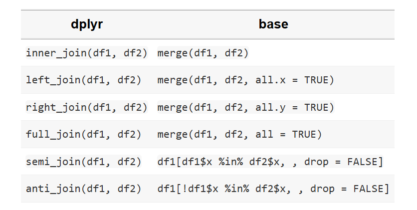

# Joins in data.table

https://cran.r-project.org/web/packages/data.table/vignettes/datatable-joins.html

## Inner join

>
Use this method if you need to combine columns from 2 tables based on one or more references but keeping only rows matched in both tables.
>

```{r}
#| warning: false
#| message: false

library(data.table)

set.seed(1234)

dt_1 <- data.table(ID_1 = paste0('A', sprintf("%02d", 1:20)),
                   week = paste0('wk_', sample(1:3, 20, replace = TRUE)),
                   x = rnorm(20),
                   y = sample(letters[1:5], 20, replace = TRUE),
                   z = rnorm(20))


dt_2 <- data.table(ID_2 = paste0('A', sprintf("%02d", 5:25)),
                   wave = paste0('wave_', sample(1:4, 21, replace = TRUE)),
                   u = runif(21))

dt_1[dt_2, on = c('ID_1' = 'ID_2'), nomatch = NULL][]
# OR
dt_2[dt_1, on = c('ID_2' = 'ID_1'), nomatch = NULL][]

# the following also works
dt_1[dt_2, on = .(ID_1 = ID_2), nomatch = NULL][]
# OR
dt_2[dt_1, on = .(ID_2 = ID_1), nomatch = NULL][]
```


### Use `merge()`

```{r}
merge(dt_1, dt_2, by.x = 'ID_1', by.y = 'ID_2')
```


## Right join

>
Use this method if you need to combine columns from 2 tables based on one or more references but keeping all rows present in the table located on the right (in the the square brackets).
>


```{r}
(re_1 <- dt_1[dt_2, on = .(ID_1 = ID_2)][])
setnames(re_1, old = 'ID_1', new = 'ID_2')
## compare 
dt_2[dt_1, on = .(ID_2 = ID_1)][]

# the following also works
(re_2 <- dt_1[dt_2, on = c('ID_1' = 'ID_2')][])
setnames(re_2, old = 'ID_1', new = 'ID_2')
```

### Use `merge()`

```{r}
merge(dt_2, dt_1, by.x = 'ID_2', by.y = 'ID_1', all.x = TRUE)
```


## Anti-join

>
This method keeps only the rows that don't match with any row of a second table.
>

```{r}
dt_1[!dt_2, on = .(ID_1 = ID_2)][]
```

## A table

Source: https://cran.r-project.org/web/packages/dplyr/vignettes/base.html




